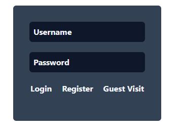
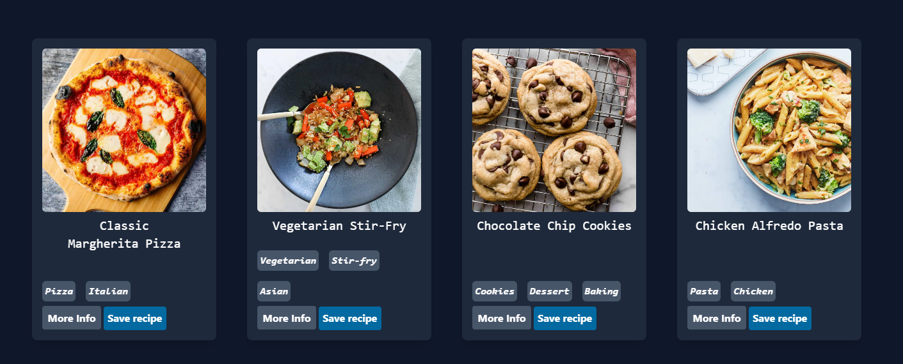
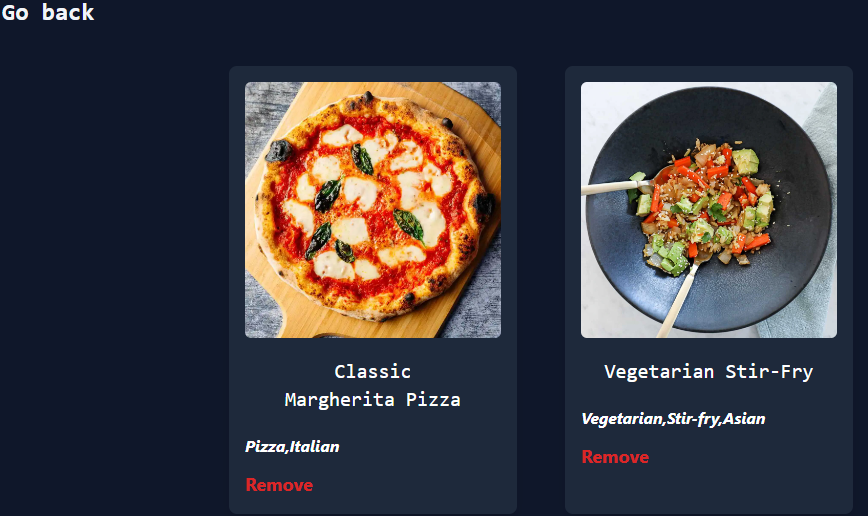
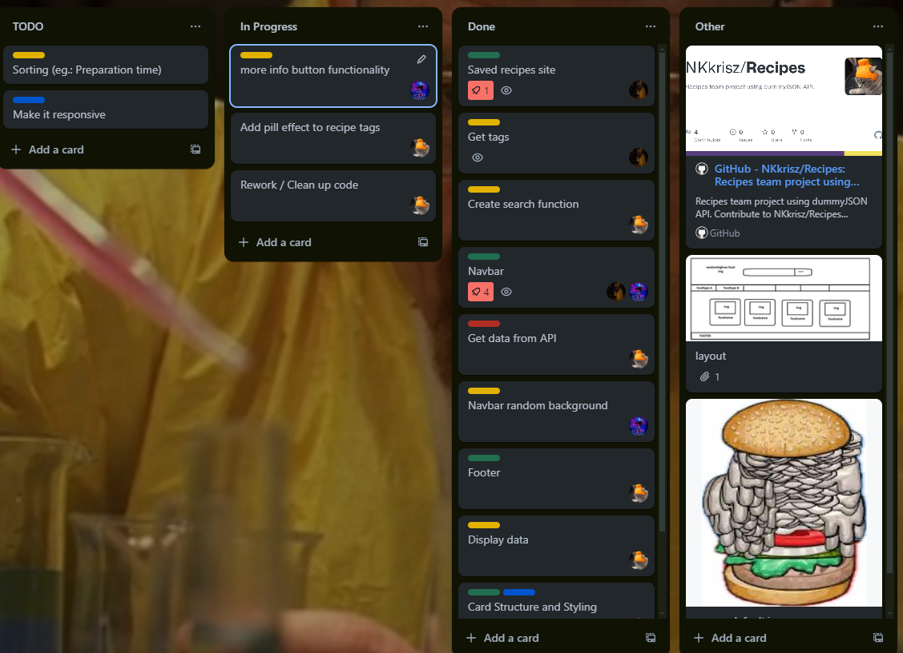

# Recipes

**Recipes team project using dummyJSON API.**

### When you enter the page you can:
>
> - Register
> - Login
> - Enter the page as a guest
> 
>   

### On the page you can:
> 
> - View recipes
> - Save and remove recipes
> - Search for recipes
> - Filter recipes by tags

> - View saved recipes 

### We used trello to assign tasks to project members

### Made by: **Szlávik Bálint, Nagy-Kőszegi Krisztián, Tóth Kristóf**